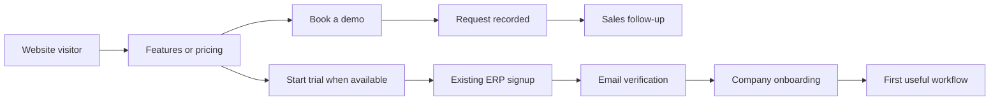

# SnapERP sales website: team brief

**Purpose:** Build a public website that explains the ERP clearly, demonstrates its value, and turns visitors into qualified demos and customer accounts.

**Working product name:** SnapERP. Confirm the final spelling, logo, legal business name, marketing domain and contact details before publishing.

**Product URL:** https://erp.werevu.co.ke/

**Scope:** This document guides design, content, engineering and sales. It does not authorize publication of unverified prices, customer endorsements or integration claims.

## 1. What the website must achieve

A visitor should quickly understand:

1. What SnapERP helps them manage.
2. Whether it suits their business.
3. What it looks like in use.
4. What they will pay and what their plan includes.
5. How to book a demo or start using it.

Lead with business outcomes: clearer stock visibility, organized sales and purchases, connected accounting, and less repeated data entry. Explain each outcome with a real product workflow rather than a long module list.

**Recommended launch approach:** Make **Book a demo** the primary action while commercial terms and live integrations are being confirmed. Offer **Start your trial** when trial duration, included features and onboarding have been verified. Keep **Sign in** visible for existing customers.

## 2. Audience and positioning

Start with Kenyan small and growing businesses that manage invoices, suppliers, inventory and accounting. Treat the segments below as proposed audiences for sales to validate.

| Audience | Their main question | What to show |
|---|---|---|
| Business owner | Can I see how the business is doing? | Dashboard, balances, sales and financial reports |
| Finance team or accountant | Can we trace transactions and produce useful reports? | General Ledger, banking, customer/supplier balances and report exports |
| Retail or counter sales team | Can we sell and record payments efficiently? | POS workflow, receipts, stock movement and configured payment options |
| Wholesaler or distributor | Can we manage stock, orders and suppliers together? | Sales orders, purchasing, stock inquiries and supplier transactions |

### Proposed positioning

> **Your sales, stock and accounts—connected.**
>
> SnapERP brings sales, purchasing, inventory, banking and financial reporting into one workspace, with modules you can configure as your business grows.

Do not position it as suitable for every industry. Validate manufacturing and other specialist workflows before building dedicated industry pages.

## 3. Sitemap and launch priorities

| Page | Purpose | Main action | Priority |
|---|---|---|---|
| Home | Explain the product and its value | Book a demo | Launch |
| Features | Show the main workflows and modules | Book a demo | Launch |
| Pricing | Explain approved plans, users and add-ons | Choose a plan / talk to sales | Launch |
| Book a demo | Capture a useful sales request | Request a demo | Launch |
| Contact | Give clear sales and support contact routes | Contact sales | Launch |
| Privacy and Terms | Present approved public policies | Read policies | Launch |
| Security and data | Explain verified protections in plain language | Ask a question | Launch, concise |
| Solutions | Explain use cases for validated customer segments | Book a relevant demo | Later |
| Resources | Publish walkthroughs, onboarding guides and useful articles | Watch / read / book a demo | Later |
| Customer stories | Provide permission-backed evidence | Book a demo | Later, when evidence exists |

Avoid launching empty Resources or Customer Stories pages. Feature detail pages can follow the first release when there is enough content to justify them.

## 4. Home page structure and draft copy

### Navigation

Logo · Features · Pricing · Security · Contact · **Sign in** · **Book a demo**

On mobile, keep the main action easy to reach without covering the page content.

### Section 1: Hero

**Headline:** Your sales, stock and accounts—connected.

**Supporting text:** Manage customers, suppliers, inventory and financial reports in one workspace. Choose the modules your business needs and give your team the access they need.

**Primary button:** Book a demo

**Secondary button:** Explore features

**Visual:** A current desktop dashboard screenshot with a smaller mobile view. Use realistic demonstration data. Show an actual screen, not a concept that implies unbuilt functionality.

### Section 2: The problems it helps solve

Use three short, concrete statements:

- Know what is in stock before making a sale or placing an order.
- Keep invoices, supplier transactions and accounting records connected.
- Give owners and finance teams clearer reports for daily decisions.

Attach a screenshot or workflow example to each claim where possible.

### Section 3: One connected workflow

Show a simple example: **Record a sale → update stock → record payment → review accounts and reports.**

Use a short product walkthrough to explain what the user does at each step. Validate the exact posting and stock behavior for the transaction type being demonstrated.

### Section 4: Feature overview

Show six useful categories: Sales, Purchasing, Inventory, Banking, Accounting & Reports, and Optional Modules. Each card needs an outcome, two or three relevant capabilities, and a link to more detail.

### Section 5: Local integrations

Introduce M-Pesa and eTIMS only with approved descriptions and current availability. Explain setup requirements and whether each is included or an add-on. Do not imply that registration, approval or configuration happens automatically.

### Section 6: Designed for your team

Show permissions, personal profiles, two-step sign-in, active-session management and company branding. Explain the value in simple language: controlled access, account visibility and familiar company colors.

### Section 7: Pricing preview

Summarize approved plans and link to full pricing. If prices are not approved, use **Talk to us about your setup**. Do not publish dummy amounts or show database seed values as commercial pricing.

### Section 8: Proof

Use approved customer quotes, named case studies, or a short product video. If none exist, show the actual product walkthrough rather than invented customer counts, star ratings or logos.

### Section 9: Closing action and footer

**Headline:** See how SnapERP fits your business.

**Button:** Book a demo

Footer: product links, contact information, Privacy, Terms, sign-in link and the correct legal business identity.

## 5. Features and claims to verify

The repository contains the capabilities below. Code presence alone does not establish production readiness, availability in every plan, or successful use with a customer's provider account.

| Capability | Proposed website description | Publication check |
|---|---|---|
| Sales | Manage customers, sales documents, invoices and receipts | Demonstrate the advertised document flows |
| Purchasing | Manage suppliers, purchase orders, goods receipts and supplier transactions | Demonstrate the complete purchasing flow |
| Inventory | Track items and stock movements | Verify the inquiries and workflows shown in screenshots |
| Banking and General Ledger | Record banking transactions and review financial accounts | Finance owner approves the examples |
| Reports and printouts | Produce financial and operational reports with company-branded accents | Confirm the advertised report and export formats |
| POS | A workspace for counter sales | Confirm plan availability and the demonstrated payment/receipt flow |
| M-Pesa collections | Request invoice payments and match configured collections | Verify live credentials, callbacks, payment posting and supported collection modes |
| eTIMS | Support configured invoice and credit-note stamping | Verify live onboarding, credentials and end-to-end stamping before claiming live availability |
| Manufacturing, fixed assets and dimensions | Optional modules for additional business workflows | Confirm configuration, plan availability and each demonstrated use case |
| Communications | Configured document email and notification channels | Name only channels tested with the chosen provider |
| Account security | Permissions, two-step sign-in and browser-session management | Confirm directory-account requirements and company session migration readiness |
| Company branding | Set a company primary color for interface and report accents | Use current screenshots and explain the supported scope |
| API | Integration access where enabled | Approve public documentation and support terms first |

Do not advertise payroll, HR, offline operation, a released native mobile app, automatic migration from competing systems, or other capabilities without separate verification.

Do not claim KRA certification, Safaricom endorsement, guaranteed compliance, zero downtime, “100% secure,” or an uptime/backup guarantee without supporting evidence and approved terms. Describe implemented protections precisely.

## 6. Pricing requirements

The platform already supports plans, included users, additional users, optional modules and multiple billing cycles. Sales must approve the actual commercial offer.

Every pricing card must state:

- Plan name and intended customer.
- Price and billing period, including how tax is presented.
- Included users and the cost of additional users.
- Included modules and separately priced add-ons.
- Trial duration and requirements, if a trial is offered.
- Setup, data-import and training charges, where applicable.
- Support channels and service hours.
- Renewal, cancellation and upgrade terms.

The product supports monthly, quarterly, semiannual and yearly cycles. Display only cycles offered commercially. Clearly distinguish the total billed amount from a monthly equivalent. Advertise a discount only when the approved prices substantiate it.

**Source of truth:** Approved platform pricing. Prefer a narrowly scoped, read-only public pricing feed or an approved content snapshot with a named owner. Do not give the marketing site database credentials or access to admin endpoints. Never send custom company pricing, internal overrides or billing records to the public site.

The seeded Starter plan and prices in QA documents are not approved selling prices.

## 7. Conversion flows

### Demo request

Collect name, business name, work email or preferred contact number, and the workflow they want to see. Company size and preferred demo time can be optional. Avoid requiring sensitive financial information at this stage.

Engineering must connect the form to an agreed sales inbox or lead system. Add server-side validation, abuse protection, delivery-failure handling and a clear success state. Show success only after the request is durably recorded. Obtain approval for any automated follow-up message.

**Suggested success copy:** “We’ve received your demo request. Our team will contact you using the details you provided.” Add a response-time promise only when sales has agreed to it.

### Trial or signup

Use the existing signup at https://erp.werevu.co.ke/platform/signup.php and sign-in at https://erp.werevu.co.ke/.

Confirm the complete email-verification and company-onboarding journey before advertising an immediate trial. If a website plan choice should carry into signup, engineering must implement and test that handoff; do not assume the existing signup accepts a plan query parameter. The ERP remains responsible for validating available plans and creating accounts.

### Existing customers

Keep **Sign in** separate from sales actions. Existing-customer support should point to the agreed support route, not enter the new-sales lead queue by default.

## 8. Design and content direction

Use the current product identity, recognizable screenshots, clear typography and generous spacing. Keep the public website's brand palette separate from individual companies' custom primary colors.

- Prioritize the product and business outcomes over decorative animation.
- Use real interface images with demonstration company data; remove personal data, credentials, account identifiers and live transaction details.
- Ensure screenshots are readable on mobile; use focused crops where a full dashboard becomes illegible.
- Use restrained animation, visible keyboard focus, labelled forms and readable text contrast.
- Add alt text to useful images and captions/transcripts to product walkthroughs.
- Use customer and partner logos only with permission. Use approved provider brand assets and avoid wording that implies endorsement.
- Keep technical implementation details in the team documentation, not in the sales journey.

## 9. Engineering and operating requirements

| Area | Requirement |
|---|---|
| Hosting | Separate public marketing pages from authenticated ERP/admin routes; agree the marketing domain and deployment owner |
| Content | Give the content owner a practical way to update copy and approved pricing without editing application code |
| Forms | Validate on the server; protect against spam; record delivery outcomes; never expose secrets in browser code |
| Analytics | Track useful conversion events without sending contact details, financial data or other personal information in event payloads |
| Search | Give each page a useful title, description and canonical URL; generate a sitemap and social-share previews; keep staging out of search |
| Mobile | Verify navigation, screenshots, pricing comparisons, forms and actions at desktop, tablet and phone sizes |
| Performance | Compress images, avoid autoplay video downloads, load media appropriately, and agree measurable page-speed targets |
| Security | Use HTTPS, appropriate security headers and maintained dependencies; exclude ERP secrets, customer data and internal routes from public content |
| Policies | Publish approved policies that cover marketing lead collection; confirm whether existing ERP policies cover this use |
| Support | Assign owners for broken forms, content changes, pricing updates and website incidents |

Suggested events: `demo_cta_clicked`, `demo_request_completed`, `pricing_viewed`, `trial_cta_clicked`, and `signup_handoff`. A click or handoff is not a completed signup or a paying customer. Define a verified completion signal before reporting those outcomes.

## 10. Work plan and ownership

| Phase | Deliverables | Accountable role | Exit condition |
|---|---|---|---|
| 1. Confirm the offer | Audience, product name, domain, prices, trial terms, supported integrations, contacts | Product/business owner with sales | Approved facts and commercial terms |
| 2. Prepare evidence | Demo dataset, screenshots, walkthrough, permission-backed customer proof | Product and QA | Every advertised workflow demonstrated |
| 3. Design and write | Sitemap, mobile/desktop layouts, final copy, approved policy content | Design and content | Reviewed page designs and content |
| 4. Build | Website, forms, pricing source, signup handoff, analytics and deployment configuration | Engineering | Reviewable staging site with connected journeys |
| 5. Validate | Browser checks, forms, lead delivery, signup, prices, accessibility and claims review | QA, sales and product | Launch checklist passed |
| 6. Launch and improve | Approved deployment, monitoring, lead follow-up and conversion review | Release owner and sales | Site works publicly and ownership is clear |

Name a person for each role and estimate delivery after the team agrees scope. Defer a blog, comparison pages and specialist industry pages until the launch pages and sales journey work well.

## 11. Launch acceptance checklist

- [ ] Product name, domain, legal identity and contact details approved.
- [ ] Home page explains the product and gives visitors a clear next action.
- [ ] Every capability claim has a demonstrated, currently supported workflow.
- [ ] M-Pesa and eTIMS wording matches verified live readiness and setup requirements.
- [ ] Pricing matches the approved source, including users, modules, billing period and tax presentation.
- [ ] Trial wording matches the actual signup and onboarding experience.
- [ ] Demo requests are recorded and arrive at the agreed sales destination; failure handling is tested.
- [ ] Signup and sign-in links work, including any supported plan handoff.
- [ ] Mobile navigation, keyboard access, form labels and readable colors checked.
- [ ] Screenshots use safe demonstration data and accurately represent the current product.
- [ ] Customer quotes and logos have publication permission.
- [ ] Policies reviewed for marketing lead collection and tracking.
- [ ] Analytics record agreed events without personal data in payloads.
- [ ] Production pages are indexable; staging and internal/admin pages are excluded from public discovery.
- [ ] Deployment approval, monitoring and rollback ownership established.
- [ ] Sales and support owners know how requests reach them and who responds.

## 12. Decisions needed from the business owner

1. Final product name, logo and marketing domain.
2. Primary launch audience and the strongest validated workflow to demonstrate.
3. Approved prices, plan contents, user/add-on costs and available billing cycles.
4. Whether to launch with demo requests, a trial, or both; approved trial terms.
5. Sales contact destination, demo scheduling method and response expectations.
6. Current live M-Pesa and eTIMS availability and any onboarding charges.
7. Onboarding, data import, training and support commitments.
8. Customer evidence and provider branding permitted for publication.

## Product references for the team

- Product identity: [`ui/config.php`](../ui/config.php)
- Signup and verification: [`platform/signup.php`](../platform/signup.php), [`platform/verify.php`](../platform/verify.php)
- Plan/module model: [`platform/sql/011_billing.sql`](../platform/sql/011_billing.sql)
- Billing cycles and prices: [`platform/sql/018_billing_cycles.sql`](../platform/sql/018_billing_cycles.sql), [`platform/sql/019_cycle_prices.sql`](../platform/sql/019_cycle_prices.sql)
- Company branding: [`docs/company-branding.md`](company-branding.md)
- Account security and sessions: [`docs/account-profile.md`](account-profile.md)
- Release validation: [`docs/qa/SNAPERP_FULL_QA.md`](qa/SNAPERP_FULL_QA.md) — use its checks as a starting point; its sample prices are QA fixtures.
